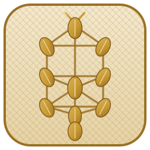

  

<h1 align="center">Grain</h1>

<em>An operating system and a civic application, built in the open, from first principles, with genuine joy.</em>

  
  
  
  
  
  

---

**Welcome.** Grain is a computer that answers to you. Your words stay on your machine. Your
identity lives in a key you hold. Every line that runs is yours to read, and every promise this
software makes is one a program has already checked.

It is early, and it says so on every page. What already works is listed below, plainly.

**Two links, and nothing else you need yet.** Read
**[why this exists](foundations/20260823-034321_the-return-that-feeds-everyone.md)** for the idea
in plain English with no code in it, or spend
**[your first hour](docs-geode/tutorials/the-first-hour.md)** cloning the tree and watching
something turn green on your own machine.

When you want more than two, **[`SOURCE.md`](SOURCE.md)** opens with the five reads that carry the
whole spirit, and **[`docs-geode/`](docs-geode/README.md)** holds the shipped shelf: the
[language reference](docs-geode/api/rishi-language-reference.md), a
[generated index of every library](docs-geode/libraries/README.md),
[four demos you can run in a minute](docs-geode/demos/README.md), the
[teaching surfaces](docs-geode/edu/README.md), and
[how to read this tree](docs-geode/study/README.md).

---

## Contents

[What Grain gives you](#what-grain-gives-you) - [What runs today](#what-runs-today) -
[Where the tree stands](#where-the-tree-stands) -
[The words we build with](#the-words-we-build-with) -
[What we are building now](#what-we-are-building-now) -
[How this tree is organised](#how-this-tree-is-organised) -
[Start here](#start-here) - [The disciplines](#the-disciplines) -
[License and community](#license-and-community)

---

## What Grain gives you

Three promises, and they are the whole of it.

**Everything names its bound.** Every list says in advance how long it may get. Every loop says
how many times it may run. Every buffer says how much it will hold. The whole system therefore
stays inside the space it declared before it started, and it can show you that it did. We call
this discipline **TAME**, and it orders itself **safety first, performance second, joy third** --
where *joy* is a real entry, meaning clear names, short functions, and the habit of writing down
*why* alongside *what*. See [`context/TAME_GUIDANCE.md`](context/TAME_GUIDANCE.md).

**A machine confirms every claim.** A **witness** is a small program that tests one promise and
prints **GREEN** when the promise holds. "The parser handles empty input" is a hope; a witness
that feeds the parser empty input on a real machine and prints green is a fact, and it is a fact
a computer stated before any person wrote a sentence about it. Every witness here also earns its
place by catching a real mistake on purpose, so you know the green line means something.

**Every page tells you which room it is in.** A page describes either something that runs today
or something we have designed and intend to build, and it always says which. That habit has its
own home at [`context/TWO_ROOMS.md`](context/TWO_ROOMS.md).

Underneath all three sits one idea, borrowed from ecological farming and explained without jargon
in **[The Return That Feeds Everyone](foundations/20260823-034321_the-return-that-feeds-everyone.md)**:
a field can be made to feed itself, growing its own fertility from plants alone. **A system that
renews itself from within needs only what it can account for.** That is a farming sentence and a
software sentence, and they turn out to be the same sentence.

## What runs today

Every item here has a witness behind it that runs green on a real machine.

- **The witness suite** -- the gates in [`tools/`](tools/) that guard every push, and the
  load-bearing piece of the whole project: the tree proves its own state on metal.
- **The Glow desk** -- the language's generator hops lower to Rye and run green. Glow is the
  language people write; **Rye** is the bounded systems language it becomes, and Rye runs
  directly on the metal. See [`glow/README.md`](glow/README.md) and [`rye/README.md`](rye/README.md).
- **A real app on a real phone** -- an installable Android package whose resource, network, and
  sensor grants follow the platform's own permission model. See [`docs/TUBE.md`](docs/TUBE.md).
- **The module seeds** -- the shell, the naming layer, the wire, and the rest, each with its own
  witness in `tools/`.
- **First light on bare hardware** -- **Aurora** cross-builds boot stages into real RISC-V
  executables in the tree.

Everything beyond this list is design: real direction, carefully written, and marked as design
wherever it appears. A full operating-system boot is a bright horizon, and this page will say so
the day a witness says otherwise.

## Where the tree stands

A program generates these four numbers and a guard keeps them true. Run
`rishi/bin/rishi run tools/r/readme_metrics.rish write` to refresh them;
[`tools/r/readme_metrics_witness.rish`](tools/r/readme_metrics_witness.rish) compares the block
against a fresh measurement on every push, so the most-read file in the project keeps telling
the truth as the tree grows.

<!-- metrics:begin -- generated by tools/r/readme_metrics.rish; do not edit by hand -->

| Reading | Now |
|---|---|
| **Fascia** -- can a reader follow any thread home | **68** / 100 |
| **Witnesses** running on metal | **1810** |
| **Rye modules** they stand over | **1940** |
| **Rooms grown past what a browser can list** | **0** |

<!-- metrics:end -->

We leave out the commit count and the file count on purpose. Both move every day, and neither
tells you whether the software is well.

## The words we build with

A name should be clear to a newcomer on their first day and still pleasant to type on their ten
thousandth, so this project reaches for the plainest, warmest word it can find. Simplicity is the
goal itself here, rather than a compromise on the way to one.

| Name | What it does, plainly |
|---|---|
| **[Caravan](caravan/)** | A group that travels together and arrives together. It starts every other part in the right order, watches each one, and brings back anything that stumbles, all inside limits fixed before it begins. |
| **[Tally](tally/)** | Keeps the books on memory. Every allocation is counted against a declared ceiling, so the system can show you it stayed inside its promise. |
| **[Mantra](mantra/)** | Names things so a name stays true. Ask for a name and you get exactly the bytes you got last time, forever. That is what makes a build reproducible. [Beginner door](foundations/20260825-211056_what-mantra-is.md). |
| **[Comlink](comlink/)** | Carries sealed messages between machines. It moves bytes without reading them, and what arrives is bit-for-bit what left. |
| **[Pond](pond/)** | A fence around a running program: this much memory, these files, this network. A program works inside exactly the boundary it was handed. |
| **[Amphora](amphora/)** | A sealed vessel for something crossing a boundary, opened by whoever it was addressed to. |
| **[Rishi](rishi/)** | The shell. The plain-language hand you use to run the tree. |
| **[Glow](glow/)** - **[Rye](rye/)** | The language people write, and the bounded systems language it lowers to. |
| **[Kumara](kumara/)** | Identity you own -- a key in your hands, and yours for as long as you hold it. |
| **[Aurora](aurora/)** | The dawn. The first code that wakes on bare hardware, before an operating system exists. |
| **[Surf](surf/)** - **[Brushstroke](brushstroke/)** | The drawing surface, and the strokes made on it. |
| **[Mycelium](mycelium/)** | The quiet network underneath, named for the thread that connects a forest. |
| **[Brix](brix/README.md)** - [beginner door](foundations/20260823-222019_what-brix-infuse-is.md) | The declaring language. A `.brix` file says what a system is made of and how the parts fit, and evaluates to plain Bron a program can read. You declare the shape; the tree checks it holds. |
| **Tablecloth** | Holds a thing by its content rather than by where you put it. Ask for the same bytes and you get the same bytes, from any room, forever. [Beginner door](foundations/20260823-222020_what-tablecloth-is.md); it runs through several rooms rather than sitting in one, and [`brushstroke/tablecloth.rye`](brushstroke/tablecloth.rye) is the nearest single file. |

Every seated term, with the date and the reason we chose it, lives in
[`context/LEXICON.md`](context/LEXICON.md).

### Declare it, address it, then say it plainly

Three of those names work together often enough to be worth reading as one idea, since it is the
habit most of this tree runs on.

**Brix declares.** A `.brix` file states what a system is made of, in one field per line with no
punctuation to get wrong. It is a statement about how things should be, written where a reader and
a program can both find it.

**Tablecloth addresses by content.** A thing is named by the bytes it is made of, so the same
request returns the same bytes from any room, and *sameness* becomes something a machine settles
rather than something a person promises.

Each of the three has a page written for someone meeting it for the first time --
[Mantra](foundations/20260825-211056_what-mantra-is.md),
[Brix infuse](foundations/20260823-222019_what-brix-infuse-is.md), and
[Tablecloth](foundations/20260823-222020_what-tablecloth-is.md) -- and each of those carries the
operation written as a **chemical formula**: what goes in, what comes out, and what stays conserved.

**Gauge says it plainly.** [New Gauge Style](context/GAUGE_STYLE.md) is how the prose about all of
it reads: bound every claim, give every figure a unit and a date, and above all **don't be too
smart about it**.

A small worked example ships in this repository, so the idea arrives as a working thing rather than
a diagram. A document sometimes belongs in two rooms at once. Moving it breaks every reference that
points at it; copying it lets the copies drift apart quietly. So
[`context/document-mirrors.brix`](context/document-mirrors.brix) **declares** the homes,
`tools/d/document_mirror_witness.rish` proves every home holds the **same bytes**, and this
paragraph explains it once in plain words. Edit the canonical, run the write, and the rest follows.
Should two homes ever disagree, a guard says so on the lap it happens.

## What we are building now

**Caravan**, and one thing at a time on purpose.

Caravan is the supervisor: the part that starts everything else and keeps it healthy. In a system
whose promise is that it stays inside its bounds, the supervisor is where that promise is kept,
so it earns our attention first. Everything above it can be trusted exactly as far as Caravan can.
It is also the hardest problem we can currently solve, and solving it opens the rest.

**Grain is molten**, and we chose that word carefully. The shapes are still moving, the interfaces
still change, and a design settled on Tuesday may be re-cut on Friday when a better one appears.
Moving a wall now costs almost nothing, and moving it once a thousand people have hung pictures
on it costs a great deal.

So the teaching comes later, and deliberately. Polished tutorials describe an interface, and an
interface still in motion would make that work obsolete twice over. What you get today is honest
marking: every page tells you whether it runs or is planned. Once the shapes settle, the teaching
begins in earnest, and the room for it already stands ready.

## How this tree is organised

A room is a promise about what you will find inside it. There are a good number of rooms here for
one reason: **thinking and building are filed separately, so each has space to be itself.**

**The rooms that ship here**

- **[`foundations/`](foundations/)** -- *why* the work exists. Durable essays that stay worth
  reading on their own. Start here for the spirit of the thing.
- **[`external-research/`](external-research/)** -- the world, studied with its real names
  attached. Outside projects read directly and cited plainly. This room stays wide and curious.
- **[`active-designing/`](active-designing/)** -- design that outlives its code: a shape, a name,
  an invariant, a trade-off. Essays about *how a thing should be*.
- **[`active-development/`](active-development/)** -- the notes of a working session: scoping a
  round, planning a lap, recording what a survey found. Notes about *what we did*.
  One question sorts the two: *would this still be worth reading if the code it describes were
  deleted?* Yes goes to designing, no goes to development.
- **[`docs-geode/`](docs-geode/)** -- the shipped documentation shelf, and an ambition we are
  growing into. A geode is plain outside and crystalline within, and that is the aim: a reference
  that rewards cracking open. It holds the
  [language reference](docs-geode/api/rishi-language-reference.md), a
  [generated index of every library](docs-geode/libraries/README.md),
  [demos you can run in a minute](docs-geode/demos/README.md), and
  [how to read this tree](docs-geode/study/README.md).
- **[`manual/`](manual/)** and **[`edu/`](edu/)** -- the onboarding rooms and the teaching material.
- **[`context/`](context/README.md)** -- the disciplines themselves, listed below.
- **[`tools/`](tools/)** -- every witness. The proof, rather than the prose.
- **[`waymarks/`](waymarks/)** and **[`context/specs/`](context/specs/)** -- the named plans and
  the settled rules.
- **[`classical-vedic-astrology/`](classical-vedic-astrology/)** -- the calendar the chapters are
  named from. This tree marks its rounds against a **rota** of element by modality, and the room
  holds the method behind that: how a chart is cast
  ([`cast_a_chart.rish`](classical-vedic-astrology/cast_a_chart.rish)), the 27 nakshatra seats
  ([`seat_nakshatra.rye`](classical-vedic-astrology/seat_nakshatra.rye)), the studies, and the
  teachings. The **readings themselves stay in the maintainer's field**, since a natal chart holds
  a named person's birth date, time, and place, and the friends whose skies seeded the library
  asked for privacy. What ships is the method, never anybody's chart.

**The rooms kept in the maintainer's field**

A few rooms hold personal working tissue, and the public seed is projected without them. They are
named here so the tree reads as one whole, with the understanding that in this copy there is
simply nothing to click.

*Session logs* keep a reasoning trace for every working round, so a later reader can follow how a
decision was actually reached. *Construction* holds the live operator card, the reds ledger, and the checkpoints: what is next, right now, and what went wrong on the way.
*Expanding-prompts* holds intent expanded into runnable plans. *Gratitude* is a reading library of
the projects we learn from, held whole and unmodified, which is why we study it here and leave
redistribution to its own authors. And *classical-vedic-astrology* is exactly what it sounds like:
a personal study room for learning and reflection, kept in the field because a person's
contemplative practice belongs to the person. It does earn one working use: a reading **rota**
brings a few foundational documents back into view on a schedule, so the reasoning behind the work
stays fresh in mind.

**Two disciplines that shape what gets written**

- **The silo** ([`context/SILO_TECHNIQUE.md`](context/SILO_TECHNIQUE.md)) -- an idea from outside
  arrives by being understood and then restated in our own words. Ideas cross freely; the original
  phrasing stays at the door. Gratitude keeps its own room, explicit and warm, so every teacher is
  thanked by name.
- **Civic style** ([`context/CIVIC_STYLE.md`](context/CIVIC_STYLE.md)) -- the same care applied to
  policy and public benefit as to code. Every system rewards something, and good design comes down
  to asking *what, exactly*, then keeping what you measure and what you want pointed the same way.

## Start here

**Your first hour**, before any map:
[`docs-geode/tutorials/the-first-hour.md`](docs-geode/tutorials/the-first-hour.md). Clone, run one
witness, read the green line it prints, write five lines and run them. One page, one path.

Shopping for the three things that hour needs -- a language model, a source forge, and somewhere to keep bytes -- has its own guide at [`docs-geode/tutorials/SHOPPING.md`](docs-geode/tutorials/SHOPPING.md). It names no winner and quotes no price on purpose, so it stays true; what it gives you is the order to shop in and the questions that decide each purchase.

Then, in order:

1. **[`SOURCE.md`](SOURCE.md)** -- from nothing to a signed, sandboxed home.
2. **[`ORGANIZING.md`](ORGANIZING.md)** -- where each kind of work lives.
3. **[`MAP.md`](MAP.md)** -- the rooms of the tree at a glance.
4. **[`manual/grain-os/`](manual/grain-os/README.md)** -- the onboarding rooms.
5. **[`CONTRIBUTING.md`](CONTRIBUTING.md)** -- how a contribution arrives: small, signed,
   component-prefixed, and written like prose.

Two root config files hold what belongs to *your* machine and *your* identity, which keeps the
tree itself a clean template. Copy **[`GLOW_HOST.template.bron`](GLOW_HOST.template.bron)** to
`GLOW_HOST.bron` for this host's operating system, architecture, and toolchain paths, and
**[`GLOW_PROFILE.template.bron`](GLOW_PROFILE.template.bron)** to `GLOW_PROFILE.bron` for the
identity that signs the work. Both stay local to you.

## The disciplines

- **[`context/TAME_GUIDANCE.md`](context/TAME_GUIDANCE.md)** -- how the code stays safe.
  Invariants stated before the code that leans on them, a bound on everything, docs and code kept
  in step. Safety first, performance second, joy third.
- **[`context/GAUGE_STYLE.md`](context/GAUGE_STYLE.md)** -- **New Gauge Style**, how the prose
  reads and the style this repository is written in (**Gauge Style** in short form, **Gauge
  Guidance** where it instructs an agent). A gauge reports a reading exactly, and this style keeps that
  exactness while adding what a gauge alone has never had: warmth, plain words, and a clear sense
  of who is reading. Its first rule comes before all the others -- **don't be too smart about
  it** -- and it inherits its warmth from [`context/RADIANT_STYLE.md`](context/RADIANT_STYLE.md),
  its habit of asking *what does this reward* from [`context/CIVIC_STYLE.md`](context/CIVIC_STYLE.md),
  and its habit of bounding every claim from TAME.
- **[`context/SIMPLE_LOVABLE_COMPLETE.md`](context/SIMPLE_LOVABLE_COMPLETE.md)** -- how a thing is
  scoped so it is worth loving.
- **[`context/TWO_ROOMS.md`](context/TWO_ROOMS.md)** -- why every page tells you whether it is
  proven or proposed.

The reasons beneath them live in [`foundations/`](foundations/README.md), among them
[the custody-first principle](foundations/20260724-200912_nothing-to-give-custody-first-principle.md)
(*build nothing that destroys*), [the wire serves the fold](foundations/20260706-022912_the-wire-serves-the-fold.md),
and [sameness is the macro](foundations/20260703-182612_sameness-is-the-macro.md).

**Standing on shoulders.** Grain is built in gratitude to the makers who came before. We study
their ideas in a clean room and write our own code beneath our own names. We owe the
static-allocation discipline behind TAME to a database team who proved it in production; the
stop-the-line, fix-it-now habit to a manufacturing tradition; clarity that scales, safety a
compiler proves, and the floor the whole house stands on to three languages that came before ours;
small tools that compose, and the freedom to run and share them, to the Unix and GNU/Linux
lineage; tensegrity, which finds strength in balanced tension, to a visionary engineer; and the
runes, referential transparency, and the personal-server dream to a project that first lit this
way, held [with thanks](.claude/rules/urbit-reframe.md). Each is thanked by name, one note apiece,
in the maintainer's field, where we keep their works whole and unmodified.

## License and community

A single top-level **[LICENSE](LICENSE)** indexes the terms: code under
**[Apache-2.0](LICENSE-APACHE) OR [MIT](LICENSE-MIT)**, your choice; prose and documentation under
**[CC-BY-4.0](LICENSE-CC-BY)**. Every commit is signed, so the history shows you who wrote it.

How we treat each other: [`CODE_OF_CONDUCT.md`](CODE_OF_CONDUCT.md). How to report a weakness
privately: [`SECURITY.md`](SECURITY.md). What changed: [`CHANGELOG.md`](CHANGELOG.md). How to
contribute: [`CONTRIBUTING.md`](CONTRIBUTING.md).

---

> *"When I am working on a problem, I never think about beauty ... but when I have finished, if
> the solution is not beautiful, I know it is wrong."* -- attributed to **Buckminster Fuller**.
>
> *"Be joyful though you have considered all the facts."* -- **Wendell Berry**,
> *Manifesto: The Mad Farmer Liberation Front*.

---

*May the front door stay plain and glad. May every promise here be one a machine can check, so you
can rest easy taking it. May the ground you stand on be yours. And may you find, on your first
visit or on your long return a decade from now, exactly what you came for, and a reason to smile
on the way through.*
